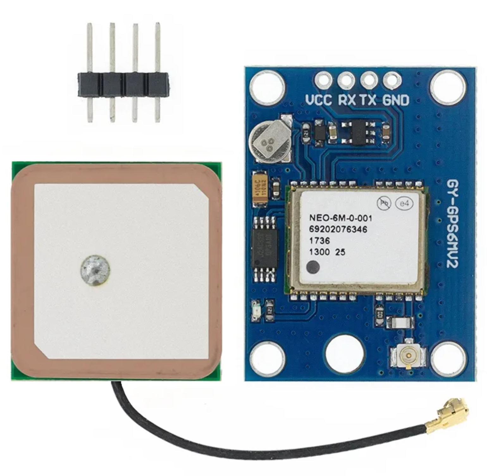

# ESP32_GPSTracker

This code is based on the LiliGO TTGO T-Call v1.4

It uses a generic NEO-6M GPS module connected via soft serial and a custom built power module to switch on and off the VCC power for the external GPS Module depending on the state of the module.

The code accepts commands via SMS that allows you to: 
- Get the operational state of the module
- Get the GPS coordinates via a Google Maps URL
- Restart the module
- Get a list of nearby WiFi SSIDs and their RSSI

To operate the device you need:
- Stable 5 volt power source with USB-C connection
- An active sim card with SMS credits available.
- A Cell phone with an active SMS plan.

Commands:
- GetTime = Replies with the SMS Timestamp in the SMS.
- GetMode = Replies with the current operational mode and how many minutes the device has been in this mode.
- GetSSIDS = Replies with a list of discovered WiFi network SSIDs and their RSSI(Reletive Signal Streangth Indicator)
- GetGPS = Gets the last GPS Timestamp and GPS location bundled up in a Google Maps URL, if no GPS lock is available an     error is returned.
- Reboot = Restart the device.
